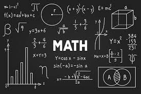

# Mathematics

## Syllabus

- Unit 3: __Applications of partial differentiation__
  -  Taylor's of two variables
  -  Errors & Approximations
  -  Maxima-Minima
  - Lagrange's Method

| Content Table |
|:-------:|
| [Question 1](#question-1) |
| [Question 2](#question-2) |
| [Question 3](#question-3) |
| [Question 4](#question-4) |

### Question 1:

Use Taylor's theorm to expand _f(x,y)_ in powers of (x-1) and (y-2).

$$
f(x,y) = x^2 + xy + y^2
$$

### Question 2:

Expand _f(x,y)_  in powers of x and y.

$$
f(x,y) = e^y \ln (1+x)
$$

### Question 3: 

Expand _f(x,y)_ at (0,0) in powers of x and y.

$$
f(x,y)= \cos{x} \cos{y}
$$

### Question 4:

Expand _f(x,y)_ by taylor series about (1,1) and hence find the value of _f(0.9,1.1)_

$$
f(x,y) = \tan^{-1} {(\frac{y}{x})}
$$

### Question 5: 

Using Differential calculus, calculate the approximate value of _y(1.997)_ where:

$$
y(x) = x^4 - 2x^3 + 9x +7
$$

### Question 6: 

The time __T__ of a complete qscillation of a simple pendulum of length _L_ is governed by the equation of __T__ , where _g_ is constant. Find the error in __T__ , where error in _L_ is 2%.

$$
T(_L_) = 2 \pi \sqrt \frac {_L_}{_g_}
$$

